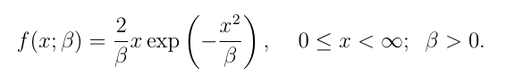

# Linear Models Assignment

## Overview
This repository contains my work for the STA03A3 Linear Models course, Assignment 1, which involves applying the Newton-Raphson and Method of Scoring to find the maximum likelihood estimate for the parameter β using the given data and a specific probability density function.

## Problem Statement
The dataset represents the strength of single carbon fibers measured in GPa, and the goal is to apply the following techniques to find the maximum likelihood estimate (MLE) for the parameter β:
1. Newton-Raphson Algorithm
2. Method of Scoring
3. Comparison of the results from the two methods
4. Construction of the 95% confidence interval for β

The formula for the probability density function is:

## Steps for Solution
- **Data Preprocessing**: Prepare the dataset for analysis.
- **Newton-Raphson**: Implement the iterative Newton-Raphson method for finding the maximum likelihood estimate of \(\beta\).
- **Method of Scoring**: Apply the method of scoring to estimate β.
- **Comparison**: Compare the results of both methods.
- **Confidence Interval**: Calculate the 95% confidence interval for β.

## License
This project is licensed under the MIT License. See the [LICENSE](LICENSE) file for more details.
